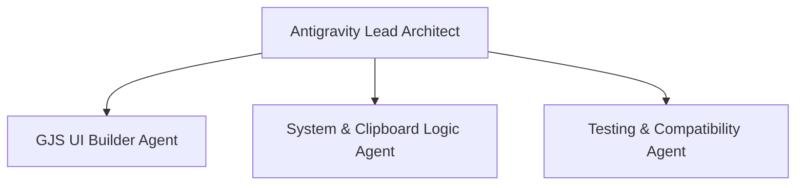

# ClipMoji Development Team & Agent Roles (AGENTS.md)

To efficiently build and test the ClipMoji GNOME extension, we can divide the work among specialized agent roles coordinated by the parent agent (**Antigravity**).

---

## 👥 Agent Roster

### 1. 👑 Antigravity (Lead Architect & Coordinator)
- **Responsibility**: Orchestrates the overall codebase architecture, acts as the primary contact for user feedback, manages data models, and ensures directory/file configurations align.
- **Key Tasks**:
  - Maintain the main roadmap and check off features.
  - Coordinate file structures.
  - Review code integration from subagents.

### 2. 🎨 GJS UI Builder (Subagent)
- **Role Type**: Frontend / Clutter UX specialist.
- **Responsibility**: Builds the user interface popup, tabs, styling, animations, and keyboard focus traversal.
- **Key Tasks**:
  - Write `ui/popup.js` (main container).
  - Implement tabs: Emojis (`ui/emojiTab.js`), Symbols (`ui/symbolsTab.js`), Kaomojis (`ui/kaomojiTab.js`), and Clipboard (`ui/clipboardTab.js`).
  - Create `stylesheet.css` using `St` styling selectors.
  - Handle key focus traversal (Up/Down/Left/Right/Tab) within the popup.

### 3. 💾 System & Clipboard Logic (Subagent)
- **Role Type**: Backend / OS integration specialist.
- **Responsibility**: Manages the clipboard lifecycle, file persistence, global keyboard shortcuts, and Wayland virtual paste mechanism.
- **Key Tasks**:
  - Implement the Gdk/St clipboard watcher inside `extension.js`.
  - Handle file persistence (`db.js`) for clipboard history and pinned items.
  - Create the Wayland-native paste simulation (`utils/paste.js`).
  - Set up keybindings (`utils/shortcuts.js`) for `Super+V` and `Super+.`.

### 4. 🧪 Testing & Compatibility (Subagent)
- **Role Type**: QA engineer.
- **Responsibility**: Ensures lint-free GJS code, correct ESM imports, and package validation.
- **Key Tasks**:
  - Verify `metadata.json` compliance.
  - Test/debug the extension package using nested shell sessions (`gnome-shell --nested`).
  - Audit memory leakage (unregistered signals, dangling timers).

---

## 🔄 Development Plan & Sync Points

1. **Phase 1: Setup & Metadata**
   - Create `metadata.json` and basic project scaffolding.
2. **Phase 2: Core Clipboard Logic**
   - Implement the clipboard watcher and DB persistence layer.
3. **Phase 3: Unified Popup UI**
   - Build the UI shell with placeholder tabs.
4. **Phase 4: Keybinds & Paste Injection**
   - Hook up `Super+V`/`Super+.` shortcuts and implement Wayland-compatible paste injection.
5. **Phase 5: Full Tab Implementation**
   - Add Emojis, Kaomojis, and Symbols logic to their respective tabs.
6. **Phase 6: Testing & Packaging**
   - Run nested shell tests and build the final `.zip` file for extension installation.
